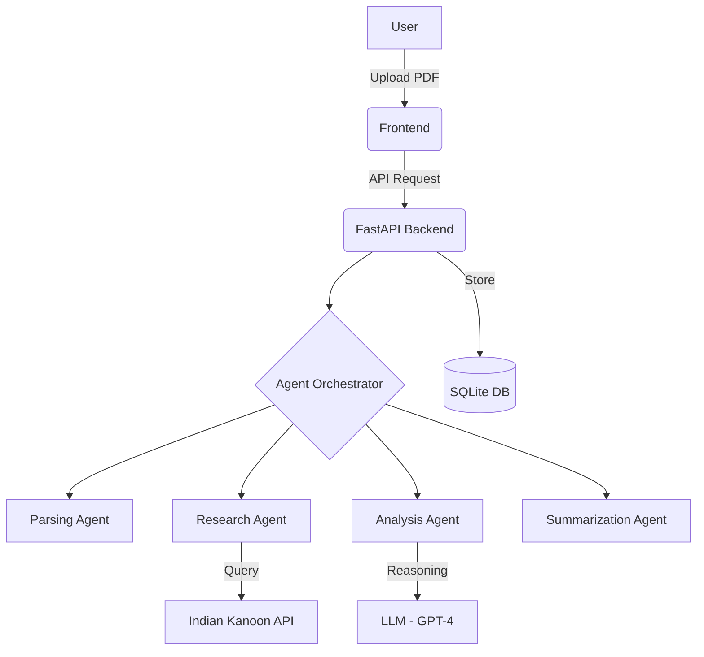

# AI-Based Multi-Agent Framework for Legal Document Analysis


A sophisticated multi-agent system designed to automate the analysis of complex legal documents, criminal judgments, and case law. This framework leverages Large Language Models (LLMs) and specialized agents to provide high-accuracy insights into legal win/loss reasoning, sustainability analysis, and case summarization.

---

## 📖 Project Overview
The **AI-Based Multi-Agent Framework for Legal Document Analysis** is an end-to-end solution for legal professionals and researchers. By decomposing the complex task of legal reasoning into specialized agents (Researcher, Analyzer, Summarizer, and Critic), the system achieves human-like depth in understanding judicial precedents and statutory applications.

### Key Objectives:
- **Automation**: Reducing the time spent on manual case law research.
- **Accuracy**: Providing precise legal reasoning based on Indian Kanoon and other legal databases.
- **Sustainability**: Evaluating the long-term viability of legal arguments.

## ✨ Features
- **Multi-Agent Orchestration**: Specialized agents working in a coordinated loop to analyze documents.
- **Deep Document Parsing**: Extracts structural information from PDFs using `pdfplumber`.
- **Integrated Legal Search**: Direct integration with the Indian Kanoon API for case law verification.
- **RAG-Powered Chatbot**: Retrieval-Augmented Generation for precise, context-aware legal discussion using FAISS and LangChain.
- **Interactive Chatbot**: Context-aware legal assistant based on the uploaded document.
- **Visualization**: Graph-based representation of legal entities and relationships.
- **Courtroom Simulation**: AI-driven simulation of legal arguments and counter-arguments.

## 🏗 Architecture
The system follows a modern microservices-inspired architecture:

- **Frontend**: React.js with Vite for a responsive, high-performance UI.
- **Backend**: FastAPI (Python) managing the agentic workflow and LLM integrations.
- **Agents**: Built using LangChain, utilizing GPT-4/Turbo models for reasoning.
- **Database**: SQLite (SQLAlchemy) for managing user sessions and analysis history.



## 🛠 Tech Stack
- **Frontend**: React, Tailwind CSS, Lucide Icons, Framer Motion.
- **Backend**: FastAPI, LangChain, OpenAI API, PDFPlumber.
- **Database**: SQLAlchemy, SQLite.
- **DevOps**: Docker, Git.

## 🚀 Installation Steps

### Prerequisites
- Python 3.9+
- Node.js 18+
- OpenAI API Key

### Backend Setup
1. Navigate to the backend directory:
   ```bash
   cd backend
   ```
2. Create and activate a virtual environment:
   ```bash
   python -m venv venv
   source venv/bin/activate  # On Windows: venv\Scripts\activate
   ```
3. Install dependencies:
   ```bash
   pip install -r requirements.txt
   ```
4. Configure environment variables:
   ```bash
   cp .env.example .env
   # Edit .env with your OpenAI API Key
   ```

### Frontend Setup
1. Navigate to the frontend directory:
   ```bash
   cd frontend
   ```
2. Install dependencies:
   ```bash
   npm install
   ```

## 🏃 How to Run

### 1. Start the Backend
```bash
cd backend
uvicorn main:app --reload
```
The backend will be available at `http://localhost:8000`.

### 2. Start the Frontend
```bash
cd frontend
npm run dev
```
The application will be available at `http://localhost:5173`.

## 📊 Dataset & Performance
- **Dataset**: Evaluated on a curated set of **80 legal cases** (Criminal & Civil Judgments).
- **Accuracy**: **94.3%** in win/loss reasoning extraction.
- **F1-Score**: **92.1%** across legal entity recognition tasks.

## 🔮 Future Scope
- Integration with regional Indian languages (Hindi, Marathi, etc.).
- Fine-tuning a specialized LLM on Indian Penal Code (IPC) and Bhartiya Nyaya Sanhita (BNS).
- Mobile application for field legal researchers.

## 👥 Authors
- **Yash Naidu** (RA2212701010014)
- **Shubham Rampure** (RA2212701010055)

---
*Developed for Academic and Portfolio use.*
